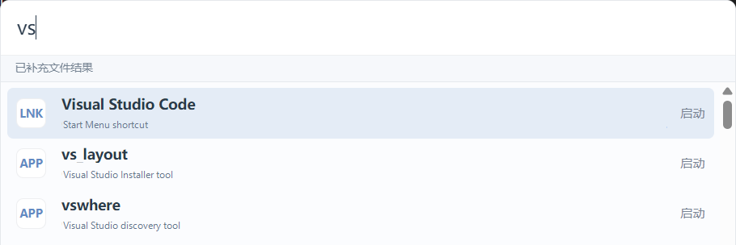

# Easy Launcher

[English](README.en.md) | 简体中文

Easy Launcher 是一个给 Windows 做的快速入口：按一下快捷键，搜索应用、文件、命令、网页、AI 动作和常用短语，然后直接执行。

它的目标很简单：把每天重复几十次的“小动作”压缩到一个输入框里。少找图标，少翻文件夹，少复制粘贴，少在多个工具之间来回切。



## 为什么我会推荐它

Windows 上其实不缺工具：开始菜单能启动应用，Everything 能搜文件，浏览器能搜索网页，AI 工具能处理文本，系统命令也都能自己找出来。

问题是它们分散在很多地方。Easy Launcher 做的事情，就是把这些高频入口收在一个安静、很快、随叫随到的小窗口里：

- 想开 VS Code、微信、Terminal，不用找图标，直接搜。
- 想找文件，接上 Everything 后可以从同一个输入框搜。
- 想翻译、总结、解释一段文字，选中文本后呼出划词菜单。
- 想算个表达式、打开系统设置、复制常用短语，也不用换应用。
- 想用自己的 OpenAI 兼容服务处理文本，可以自己填 Base URL、API Key 和模型。

这不是一个“概念 demo”。它已经能作为个人 Windows 桌面上的日常工具使用，尤其适合每天频繁启动应用、找文件、处理文字和切换工作上下文的人。

## 亮点

- `Alt+1` 呼出或隐藏主窗口，输入后直接执行。
- 搜索开始菜单、桌面和常见安装目录中的应用。
- 集成 Everything 文件搜索，支持打开文件、打开所在目录、复制路径。
- 支持计算器、系统命令、网页搜索、常用短语和自定义命令。
- 选中文本后按 `Ctrl+Shift+Space` 呼出划词菜单。
- 划词菜单支持翻译、总结、解释、网页搜索和复制。
- AI 使用 OpenAI 兼容 Chat Completions 接口，支持流式输出和取消。
- 搜索源开关、快捷键、AI 配置、开机自启动都可以在设置里调整。
- 支持配置导入导出，默认不导出 API Key。
- 托盘常驻，提供打开主窗口、打开设置、检查 Everything 状态和退出。

## 适合谁

Easy Launcher 适合这些场景：

- 你主要使用 Windows 10/11。
- 你习惯用键盘快速启动应用和文件。
- 你已经在用 Everything，或者希望文件搜索更快。
- 你经常处理选中文本，比如翻译、总结、解释或搜索。
- 你希望 AI 功能走自己的 OpenAI 兼容服务，而不是绑定某个固定平台。

如果你需要企业部署、自动更新、代码签名、跨平台支持或凭据保险库级别的密钥保护，这个版本还不适合直接用于严肃生产环境。

## 一分钟上手

默认快捷键：

- 主启动器：`Alt+1`
- 划词菜单：`Ctrl+Shift+Space`

主启动器：

1. 按 `Alt+1` 打开 Easy Launcher。
2. 输入应用名、文件名、命令、计算表达式、短语或网页搜索内容。
3. 用方向键选择结果，按 `Enter` 执行。
4. 文件结果支持打开、打开目录和复制路径。
5. 点击“设置”可以调整搜索源、快捷键、AI、Everything 和启动项。

划词菜单：

1. 在任意应用中选中文本。
2. 按 `Ctrl+Shift+Space` 呼出动作菜单。
3. 选择翻译、总结、解释、网页搜索或复制。

也可以在设置中把划词触发切到“Ctrl+划词”：按住 `Ctrl` 并拖选文本，松开鼠标后自动呼出菜单。

## 系统要求

- Windows 10 或 Windows 11。
- 可选：Everything，用于更快的文件搜索。
- 可选：OpenAI 兼容 API 服务，用于 AI 翻译、总结和解释。

从源码开发或构建还需要：

- Node.js 18 或更新版本。
- Rust stable toolchain。
- Microsoft C++ Build Tools 2022，包含 MSVC 和 Windows SDK。

## 从源码运行

安装依赖：

```powershell
npm install
```

检查 Tauri 桌面开发环境：

```powershell
npm run tauri -- info
```

启动桌面应用：

```powershell
npm run tauri -- dev
```

也可以使用统一任务脚本交互选择启动或打包：

```powershell
npm run task
```

只启动 Web UI：

```powershell
npm run dev
```

Vite 开发地址：

```text
http://127.0.0.1:1420/
```

## 构建和测试

构建前端：

```powershell
npm run build
```

运行 Rust 测试：

```powershell
cargo test --manifest-path src-tauri/Cargo.toml
```

构建桌面应用和 MSI：

```powershell
npm run tauri -- build
```

也可以使用打包脚本：

```powershell
npm run build:msi
```

MSI 产物位置：

```text
src-tauri\target\release\bundle\msi\
```

如果 `cargo` 不在系统 `PATH` 中，请先安装 Rust，或在当前 shell 中设置 `CARGO_HOME`、`RUSTUP_HOME` 并把 Cargo 的 `bin` 目录加入 `PATH`。

`npm run tauri -- ...` 会通过 `scripts/tauri-with-rust-env.mjs` 启动 Tauri CLI。脚本会使用当前 shell 或 `.env.local` 中已有的 `CARGO_HOME` 和 `RUSTUP_HOME`；如果没有设置这些变量，则直接依赖系统 `PATH` 中可用的 `cargo`。

## Everything 文件搜索

Everything 是可选增强，不是 Easy Launcher 启动的硬依赖。

安装 Everything 后，Easy Launcher 会优先使用 IPC 搜索文件；如果 IPC 不可用，可以使用 Everything HTTP Server 作为备用，默认访问 `127.0.0.1:8080`。

如果 Everything 已运行但 HTTP 备用接口未开启，界面会提示到 Everything 中打开：

```text
工具 > 选项 > HTTP 服务器
```

如果 Everything 安装在非常规位置，可以在启动应用前设置环境变量：

```powershell
$env:EASY_LAUNCHER_EVERYTHING_EXE='<path-to-Everything.exe>'
```

也可以写入本机 `.env.local`，该文件已被 `.gitignore` 排除：

```text
EASY_LAUNCHER_EVERYTHING_EXE=<path-to-Everything.exe>
```

## AI 配置

AI 功能使用 OpenAI 兼容 Chat Completions 接口。项目不附带 API Key，也不会把请求代理到项目维护者的服务器。

在设置面板中填写：

- Base URL，例如 `https://api.openai.com`、`https://api.example.com/v1` 或完整 `/v1/chat/completions` 地址。
- API Key。
- Model，例如 `gpt-4.1-mini` 或兼容服务提供的模型名。

支持的动作：

- 翻译
- 总结
- 解释

AI 请求默认由 Rust 后端发起，前端通过 Tauri event 接收流式输出。

## 本地数据和安全

运行时数据目录：

```text
%LocalAppData%\EasyLauncher\
```

主要文件：

```text
data.db              SQLite 数据库
exports\             配置导出目录
logs\                日志目录
```

SQLite 中会保存：

- 设置项
- 最近使用记录
- 应用索引
- AI 配置

当前版本没有接入 Windows Credential Manager。API Key 会明文保存在本机 SQLite 数据库中：

```text
%LocalAppData%\EasyLauncher\data.db
```

默认配置导出不会包含 `ai.api_key`。导出内容只包含非敏感设置，例如快捷键、搜索源开关、AI Base URL、AI Model 和开机自启动开关。

划词取词会临时模拟 `Ctrl+C`，等待系统剪贴板内容变化后尝试恢复原文本剪贴板。剪贴板历史没有敏感内容过滤。

更完整的安全边界和报告方式见 `SECURITY.md`。

## 配置导入导出

设置面板中可以导出配置 JSON。导出文件默认写入：

```text
%LocalAppData%\EasyLauncher\exports\
```

导入时需要输入 JSON 文件路径。导入只接受当前版本支持的白名单设置，非法 JSON、未知版本、非法快捷键或非法布尔值会显示错误提示。

默认不导出：

- API Key
- 最近使用记录
- 应用索引

## 已知限制

- 当前只支持 Windows 10/11。
- macOS 和 Linux 暂不支持。
- UWP / Microsoft Store 应用扫描暂不支持。
- Everything HTTP Server 需要用户手动在 Everything 中开启。
- AI 真实调用需要用户自行配置可用的 OpenAI 兼容服务。
- API Key 明文保存在本机 SQLite 中。
- 划词取词通过模拟 `Ctrl+C` 实现，部分应用可能禁止复制或无法读取选中文本。
- `Ctrl+划词` 使用 Windows 全局键鼠监听实现，可能受安全软件、远程桌面、管理员权限边界或特殊应用输入模型影响。
- 模拟复制会短暂占用剪贴板；如果原剪贴板不是文本内容，当前版本不能完整恢复。
- MSI 暂未签名，Windows 可能显示 SmartScreen 或安全提示。
- 尚未完成自动更新和代码签名。

## 贡献

欢迎提交 bug report、feature request 和 PR。参与前请先阅读 `CONTRIBUTING.md`，其中包含开发环境、分支建议、代码风格、验证命令、PR 要求和安全注意事项。

提交问题时请尽量提供 Windows 版本、安装方式、Everything 状态、AI 是否启用、复现步骤、期望结果和实际结果。涉及 UI、快捷键、托盘、安装器、Everything、AI 或划词菜单的问题，截图或录屏通常会更容易定位。

不要在 issue、PR、截图、日志或导出配置中公开 API Key、Authorization header、真实 token、本机数据库、敏感文件路径或用户隐私文本。

## 发布

发布流程、校验命令和 Release 文案边界见 `RELEASE.md`。

当前 MSI 暂未签名。请只从项目 Release 页面或可信的本地源码构建获取安装包。

## 许可证

本项目使用 MIT License，见 `LICENSE`。
